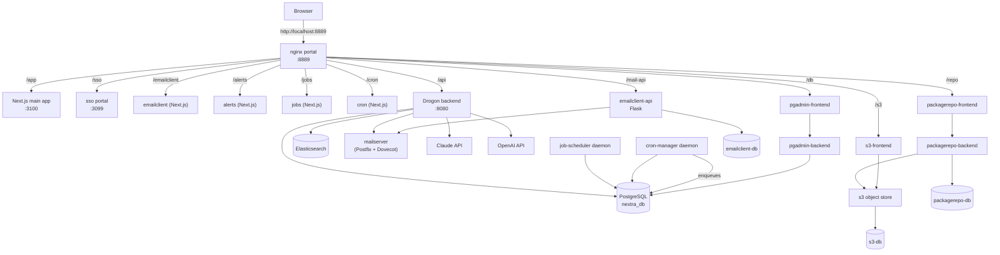

# System Architecture

This document describes how the Nextra template wires together
its many moving parts. For per-daemon detail see
`docs/services.md`; for per-tool detail see `docs/tools.md`.

---

## High-Level Overview

Everything a browser sees goes through the nginx portal on port
`8889`. Nginx reverse-proxies each sub-path to a different
upstream container — the main Next.js app, the SSO portal, the
backend API, or one of the operator tools.



The `backend`, `job-scheduler`, and `cron-manager` services all
come from the same `nextra-api` binary — they are the `serve`,
`job-scheduler`, and `cron-manager` CLI subcommands defined in
`backend/src/main.cpp`. See `docs/services.md` for the full
catalog.

The operator tools (`emailclient`, `alerts`, `jobs`, `cron`,
`packagerepo-frontend`, `s3-frontend`, `pgadmin-frontend`) are
independent Next.js apps mounted into the portal by nginx
`location` blocks. All UI-facing tools sit behind the nginx
`auth_request /_sso_validate` SSO gate; the sso tool itself is
the only ungated UI. See `docs/tools.md`.

---

## Frontend Architecture

### Technology Stack
- **Framework**: Next.js 16.2 with App Router
- **Language**: TypeScript (strict mode)
- **UI Library**: MUI v7 (Material Design 3 tokens)
- **State Management**: Redux Toolkit 2 + RTK Query
- **i18n**: next-intl with proxy.ts pattern
- **Build**: Turbopack (development), Webpack (production)
- **React**: 19.x

### Component Hierarchy (Atomic Design)

```
src/components/
├── atoms/          Single UI primitives (< 100 LOC each)
│   ├── Button, TextField, Badge, Avatar
│   ├── ProgressBar, Chip, Tooltip, Skeleton
│   └── IconButton
│
├── molecules/      Small composed units
│   ├── NotificationBell, ThemeToggle, LocaleSwitcher
│   ├── FormField, UserBadge, StreakCounter
│   └── PointsDisplay, SearchBar
│
├── organisms/      Complex UI sections
│   ├── Navbar, Footer, HeroSection, FeatureGrid
│   ├── LoginForm, RegisterForm
│   ├── LeaderboardTable, BadgeShowcase
│   └── NotificationPanel, ChatPanel, AiChatMessage
│
└── providers/      React context providers
    ├── ThemeProvider   (MUI color scheme)
    ├── StoreProvider   (Redux store)
    ├── IntlProvider    (next-intl)
    └── AuthGate        (route protection)
```

### Provider Stack (Root Layout)

```
<StoreProvider>
  <ThemeProvider>
    <IntlProvider>
      <AuthGate>
        {children}
      </AuthGate>
    </IntlProvider>
  </ThemeProvider>
</StoreProvider>
```

### State Management

```
Redux Store
├── auth          User session, tokens, isAuthenticated
├── notifications Items array, unread count
├── theme         Mode: light | dark | system
├── gamification  Points, level, badges, streak, leaderboard
├── chat          Messages, isStreaming, activeProvider
├── ui            Sidebar, notification panel, active modal
└── [api]         RTK Query cache (auto-managed)
```

Persist whitelist: `auth`, `theme`, `chat.messages` (last 50 messages).

### Routing Structure

```
src/app/
├── layout.tsx                  Root layout (providers)
└── [locale]/
    ├── layout.tsx              Locale layout (setRequestLocale)
    ├── page.tsx                Landing / Hero page
    ├── not-found.tsx           404 page
    ├── (auth)/
    │   ├── login/page.tsx
    │   └── register/page.tsx
    ├── (dashboard)/
    │   ├── layout.tsx          Dashboard shell (Navbar + Sidebar)
    │   ├── dashboard/page.tsx
    │   ├── leaderboard/page.tsx
    │   ├── profile/page.tsx
    │   ├── chat/page.tsx
    │   └── notifications/page.tsx
    └── (public)/
        ├── about/page.tsx
        └── contact/page.tsx
```

---

## Backend Architecture

### Technology Stack
- **Framework**: Drogon 1.9.8 (C++ async web framework)
- **Language**: C++20
- **ORM**: Drogon ORM (code-generated models)
- **Dependencies**: Conan 2 (`conanfile.py`)
- **Build**: CMake 3.20+
- **Key libs**: nlohmann/json, spdlog, jwt-cpp, boost 1.86

### Layered Architecture

```
┌──────────────────────────────────────────────────┐
│                  Controllers                      │
│  (HTTP handlers, request parsing, response build) │
├──────────────────────────────────────────────────┤
│                    Filters                        │
│  (JWT auth, CORS, rate limiting)                  │
├──────────────────────────────────────────────────┤
│                   Services                        │
│  (Business logic, orchestration)                  │
├──────────────────────────────────────────────────┤
│                    Models                         │
│  (Drogon ORM, generated from schema)              │
├──────────────────────────────────────────────────┤
│                   Utilities                       │
│  (JWT, password hashing, validators, helpers)     │
├──────────────────────────────────────────────────┤
│                  PostgreSQL 16                    │
└──────────────────────────────────────────────────┘
```

### Controller Mapping

| Controller | Base Path | Responsibility |
|---|---|---|
| AuthController | `/api/auth` | Registration, login, tokens, password reset |
| UserController | `/api/users` | User profiles, stats, badge lists |
| GamificationController | `/api/gamification` | Badges, points, streaks, leaderboard |
| NotificationController | `/api/notifications` | Inbox, read status, deletion |
| ChatController | `/api/chat` | AI message send, history, clear |
| HealthController | `/api/health` | Service health check |

### Service Layer

| Service | Responsibility |
|---|---|
| AuthService | Password hashing, JWT issue/verify, email confirmation tokens |
| EmailService | SMTP via mailio, HTML templates from constants |
| GamificationService | Points award, badge criteria evaluation, streak tracking, level computation |
| NotificationService | Notification creation triggered by gamification events |
| AiService | Async HTTP to Claude and OpenAI APIs via Drogon HttpClient |
| MigrationService | SQL file execution, migration version tracking |

### Filter Chain

Every authenticated request passes through:

```
Request -> CorsFilter -> JwtAuthFilter -> RateLimitFilter -> Controller
```

- **CorsFilter**: Sets `Access-Control-Allow-Origin` and related headers.
- **JwtAuthFilter**: Validates the JWT, checks the token blocklist,
  attaches user context to the request.
- **RateLimitFilter**: Per-IP and per-user rate limiting using an
  in-memory sliding window.

---

## Database Schema (ER Diagram)

```
┌──────────────┐     ┌──────────────┐     ┌───────────────┐
│    users     │     │   badges     │     │  user_badges  │
├──────────────┤     ├──────────────┤     ├───────────────┤
│ id (UUID PK) │◄────┤ id (PK)      │◄────┤ id (PK)       │
│ email        │     │ name         │     │ user_id (FK)  │
│ username     │     │ description  │     │ badge_id (FK) │
│ password_hash│     │ icon_url     │     │ earned_at     │
│ display_name │     │ category     │     └───────────────┘
│ avatar_url   │     │ points_req   │
│ is_active    │     │ criteria_json│
│ is_confirmed │     └──────────────┘
│ role         │
│ total_points │     ┌──────────────┐
│ current_level│     │  points_log  │
│ created_at   │     ├──────────────┤
│ updated_at   │     │ id (PK)      │
└──────┬───────┘     │ user_id (FK) │──► users
       │             │ amount       │
       │             │ reason       │
       │             │ source       │
       │             │ created_at   │
       │             └──────────────┘
       │
       │             ┌──────────────┐
       ├────────────►│   streaks    │
       │             ├──────────────┤
       │             │ id (PK)      │
       │             │ user_id (FK) │  UNIQUE
       │             │ current      │
       │             │ longest      │
       │             │ last_date    │
       │             └──────────────┘
       │
       │             ┌───────────────┐
       ├────────────►│ notifications │
       │             ├───────────────┤
       │             │ id (PK)       │
       │             │ user_id (FK)  │
       │             │ title         │
       │             │ body          │
       │             │ type          │
       │             │ is_read       │
       │             │ metadata_json │
       │             │ created_at    │
       │             └───────────────┘
       │
       │             ┌────────────────┐
       ├────────────►│ chat_messages  │
       │             ├────────────────┤
       │             │ id (PK)        │
       │             │ user_id (FK)   │
       │             │ role           │
       │             │ content        │
       │             │ provider       │
       │             │ model          │
       │             │ tokens_used    │
       │             │ created_at     │
       │             └────────────────┘
       │
                     ┌──────────────────┐
                     │ token_blocklist  │
                     ├──────────────────┤
                     │ id (PK)          │
                     │ jti              │
                     │ token_type       │
                     │ created_at       │
                     └──────────────────┘
```

---

## Data Flow Diagrams

### Authentication Flow

```
Browser                  Next.js              Drogon API           PostgreSQL
  │                        │                      │                    │
  │  POST /login           │                      │                    │
  │───────────────────────►│  POST /api/auth/login│                    │
  │                        │─────────────────────►│                    │
  │                        │                      │  SELECT user       │
  │                        │                      │───────────────────►│
  │                        │                      │◄───────────────────│
  │                        │                      │                    │
  │                        │                      │  Verify password   │
  │                        │                      │  Generate JWT pair │
  │                        │                      │  Award login pts   │
  │                        │                      │                    │
  │                        │  { access_token,     │                    │
  │                        │    refresh_token }   │                    │
  │                        │◄─────────────────────│                    │
  │  Store in Redux        │                      │                    │
  │◄───────────────────────│                      │                    │
  │                        │                      │                    │
  │  Subsequent requests:  │                      │                    │
  │  Authorization: Bearer │                      │                    │
  │───────────────────────►│─────────────────────►│                    │
  │                        │                      │  JwtAuthFilter     │
  │                        │                      │  validates token   │
```

### Gamification Flow

```
User Action (login, chat, etc.)
        │
        ▼
┌─────────────────────┐
│  GamificationService│
│  award_points()     │
├─────────────────────┤
│ 1. Insert points_log│──────► points_log table
│ 2. Update user total│──────► users.total_points
│ 3. Check level up   │
│    - Compare to     │
│      thresholds in  │
│      gamification   │
│      .json          │
│ 4. Check badge      │
│    criteria         │──────► badges.criteria_json
│ 5. Award badge if   │
│    criteria met     │──────► user_badges table
│ 6. Update streak    │──────► streaks table
└─────────┬───────────┘
          │
          ▼
┌─────────────────────┐
│ NotificationService │
│ create_notification │
├─────────────────────┤
│ - badge_earned      │──────► notifications table
│ - level_up          │
│ - streak_milestone  │
└─────────────────────┘
```

### AI Chat Flow

```
Browser              Next.js           Drogon API          External AI
  │                    │                   │                    │
  │ Send message       │                   │                    │
  │───────────────────►│ POST /api/chat    │                    │
  │                    │  /messages        │                    │
  │                    │──────────────────►│                    │
  │                    │                   │  Store user msg    │
  │                    │                   │──► chat_messages   │
  │                    │                   │                    │
  │                    │                   │  Forward to AI     │
  │                    │                   │───────────────────►│
  │                    │                   │                    │
  │                    │                   │  AI response       │
  │                    │                   │◄───────────────────│
  │                    │                   │                    │
  │                    │                   │  Store AI msg      │
  │                    │                   │──► chat_messages   │
  │                    │                   │                    │
  │                    │                   │  Award chat pts    │
  │                    │                   │──► points_log      │
  │                    │                   │                    │
  │                    │  { response }     │                    │
  │                    │◄──────────────────│                    │
  │ Display message    │                   │                    │
  │◄───────────────────│                   │                    │
```

---

## Deployment Architecture

```
┌──────────────────────────────────────────┐
│              CapRover Server              │
│                                          │
│  ┌──────────────────────────────────┐    │
│  │  Nginx Reverse Proxy (built-in)  │    │
│  │  SSL termination (Let's Encrypt) │    │
│  └──────────┬──────────┬────────────┘    │
│             │          │                 │
│    ┌────────▼──┐  ┌────▼───────────┐    │
│    │ nextra-web│  │  nextra-api    │    │
│    │ (Next.js) │  │  (C++ binary)  │    │
│    │ Port 3000 │  │  Port 8080     │    │
│    └───────────┘  └────┬───────────┘    │
│                        │                 │
│               ┌────────▼─────────┐       │
│               │  PostgreSQL 16   │       │
│               │  (Docker volume) │       │
│               └──────────────────┘       │
└──────────────────────────────────────────┘
```

Each service runs in its own Docker container managed by CapRover.
The Nginx reverse proxy handles SSL termination and routes requests
to the appropriate container based on the subdomain.

---

## Supporting Tools

### Package Repository (`tools/packagerepo/`)
Self-hosted package repository manager with its own backend and
Material UI + Next.js frontend. Manages build artifacts and
dependency distribution for offline / air-gapped environments.

### S3 Server (`tools/s3server/`)
Lightweight S3-compatible object store for local development
and offline Docker builds. Serves preloaded packages without
requiring external network access.

### Offline Build (`docker-compose.offline.yml`)
Uses the S3 server and packagerepo to enable fully air-gapped
Docker builds with preloaded Conan and npm dependencies.
