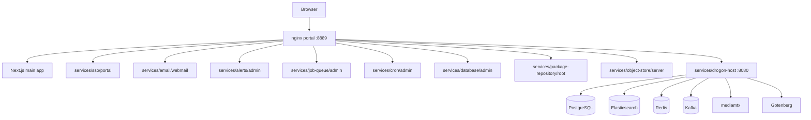
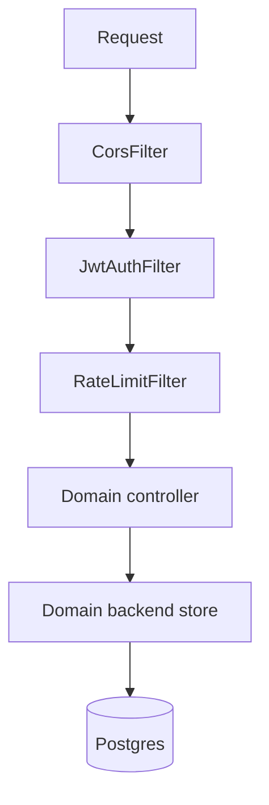

# System Architecture

Nextra is organised as a flat set of **domain slices** under
`services/`. Every domain owns its backend code, HTTP
controllers, SQL migrations, tests, and (optionally) its own
Next.js UI. There is no monolithic `backend/` or `tools/`
directory — the refactor deleted both.

See [domain-layout.md](domain-layout.md) for the canonical
subfolder rules, [domains.md](domains.md) for the catalogue of
all 55+ domains, and [migration-dag.md](migration-dag.md) for
how per-domain migrations are stitched together.

---

## High-Level Overview

`services/drogon-host/` is the Drogon binary shell — it owns
`main.cpp`, the CLI dispatch table, the server config, and
all HTTP filters. At build time it links every other domain's
`backend/` and `controllers/` into one binary, then dispatches
daemons via CLI sub-commands (see
`services/drogon-host/backend/cli_dispatch_daemons_table.h`).

---

## Daemons

All daemons are sub-commands of the same `nextra-api` binary.
Each lives in `services/<domain>/backend/commands/` and is
registered in `cli_dispatch_daemons_table.h`:

| Domain                | CLI sub-command        |
|-----------------------|------------------------|
| `services/drogon-host`| `serve`                |
| `services/job-queue`  | `job-scheduler`        |
| `services/cron`       | `cron-manager`         |
| `services/backup`     | `backup-manager`       |
| `services/image`      | `image-processor`      |
| `services/streaming`  | `media-streaming`      |
| `services/notifications` | `notification-router` |
| `services/pdf`        | `pdf-generator`        |
| `services/search`     | `search-indexer`       |
| `services/video`      | `video-transcoder`     |
| `services/webhooks`   | `webhook-dispatcher`   |

See [services.md](services.md) for per-daemon detail.

---

## Next.js UIs

Every end-user UI lives under its owning domain using an
**audience label** subfolder (see
[domain-layout.md](domain-layout.md)):

- `admin/` — operator consoles (SSO-gated)
- `portal/` — the login portal itself (ungated)
- `webmail/` — end-user mail UI
- `public/` — publicly reachable pages
- `server/`, `root/`, `viewer/`, `catalog/` — domain-specific

Nginx (`docker/nginx/nginx.conf`) mounts each UI at a sub-path
and puts the `auth_request /_sso_validate` gate in front of
everything except `services/sso/portal/`.

---

## Event & Data Plane

- **Postgres** — primary store. One schema per domain, with
  per-domain migration dirs topo-sorted by
  `services/migration-graph.json`.
- **Redis** — caches, rate-limit buckets, presence.
- **Kafka** — audit events, notification events, search-index
  update events. Consumed by `services/audit`,
  `services/notifications`, `services/search`.
- **Elasticsearch** — full-text search index, written by
  `services/search/backend/commands/search_indexer`.
- **mediamtx / Gotenberg** — media ingest and HTML-to-PDF.

---

## Request Lifecycle

Filters are defined in `services/http-filters/backend/` and
linked into `drogon-host` at build time. Controllers live in
`services/<domain>/controllers/` and call into stores/services
from `services/<domain>/backend/`.

---

## Deployment

Each daemon and each UI is its own docker-compose service,
all built from the same monorepo context with Docker build
contexts that pull in the individual domain subtrees plus
`shared/`. See [deployment.md](deployment.md) for the
CapRover topology.
