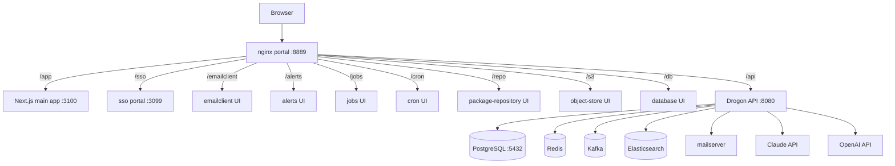
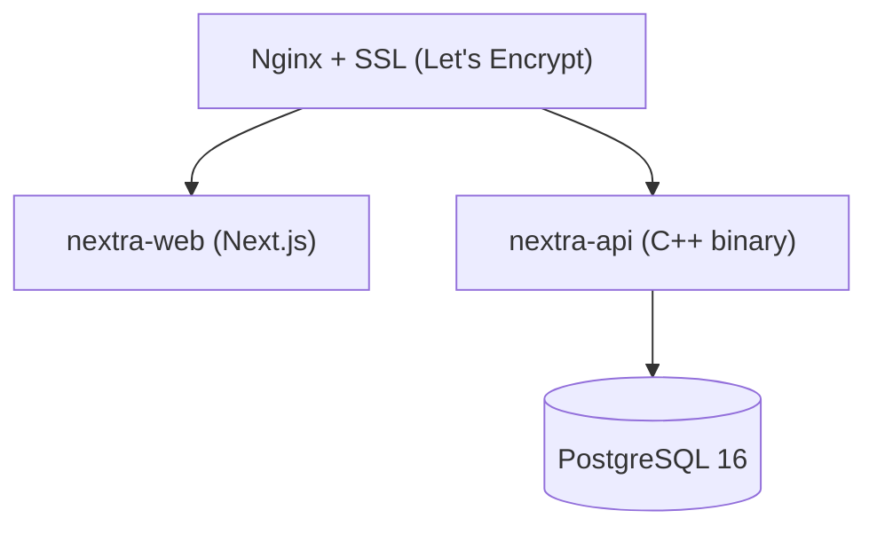

# System Architecture

Nextra is a domain-sliced monorepo. Every feature lives under
`services/<domain>/`. This document describes how the pieces wire
together at runtime. For the canonical subfolder reference see
`docs/domain-layout.md`; for the service catalogue see
`docs/services.md`.

---

## High-Level Overview

All browser traffic enters through the nginx portal on port `8889`.



The `Drogon API` service (`services/drogon-host/`) is the same
binary for all backend subcommands — `serve`, `job-scheduler`, and
`cron-manager` are separate compose containers running the same
binary with a different CLI subcommand.

---

## Code Layout — Domain Slices

All C++ and Next.js domain code lives under `services/`:

```
services/
  auth/              # authentication domain
  users/             # user CRUD and profiles
  blog/              # articles and blog
  wiki/              # wiki pages + revisions
  notifications/     # notification router
  job-queue/         # durable job queue
  cron/              # cron expression scheduler
  ...                # 50+ other domains

  drogon-host/       # Drogon shell (main.cpp, serve, config)
  http-filters/      # JWT / CORS / rate-limit filters
  orm-models/        # Drogon ORM generated models
  infra/             # Kafka / Redis client shims
  manager-cli/       # C++ project automation CLI
  migration-runner/  # topo-sorted per-domain migrator
```

See `docs/domain-layout.md` for the full canonical subfolder list
and `docs/domains.md` for a table of every domain.

---

## Frontend Architecture

### Technology Stack

- Framework: Next.js 16 App Router, TypeScript strict mode
- UI: MUI v7 with Material Design 3 tokens
- State: Redux Toolkit 2 + RTK Query
- i18n: next-intl
- React: 19.x

### Component Hierarchy (Atomic Design)

```
frontend/src/components/
  atoms/       Single UI primitives (< 100 LOC)
  molecules/   Composed from atoms
  organisms/   Complex UI sections
  providers/   React context providers
```

### Provider Stack (Root Layout)

```
<StoreProvider>
  <ThemeProvider>
    <IntlProvider>
      <AuthGate>
        {children}
      </AuthGate>
    </IntlProvider>
  </ThemeProvider>
</StoreProvider>
```

### Redux Store Shape

```
auth          User session, tokens, isAuthenticated
notifications Items array, unread count
theme         Mode: light | dark | system
gamification  Points, level, badges, streak, leaderboard
chat          Messages, isStreaming, activeProvider
ui            Sidebar, notification panel, active modal
[api]         RTK Query cache (auto-managed)
```

---

## Backend Architecture

### Technology Stack

- Framework: Drogon 1.9.8, C++20
- ORM: Drogon ORM (code-generated in `services/orm-models/`)
- Dependencies: Conan 2
- Key libs: nlohmann/json, spdlog, jwt-cpp, boost 1.86

### Layered Architecture

```
Controllers  (HTTP handlers — services/<domain>/controllers/)
Filters      (JWT / CORS / rate-limit — services/http-filters/)
Services     (business logic — services/<domain>/backend/)
Models       (Drogon ORM — services/orm-models/)
PostgreSQL 16
```

### Filter Chain

```
Request -> CorsFilter -> JwtAuthFilter -> RateLimitFilter -> Controller
```

---

## Data Flow — Authentication

```
Browser --> Next.js --> POST /api/auth/login --> Drogon
                                                    |
                                            SELECT user (PG)
                                            Verify password
                                            Issue JWT pair
                                                    |
                                        { access_token, refresh_token }
                                                    |
Browser <-- Redux store <-- Next.js <-----------'
```

---

## Data Flow — AI Chat

```
Browser --> POST /api/chat/messages --> Drogon
                                          |
                                  store user msg (PG)
                                  forward to AI provider
                                          |
                                  store AI response (PG)
                                  award chat points (PG)
                                          |
Browser <-- { response } <-----------'
```

---

## Deployment Architecture



Each service runs in its own Docker container. The nginx reverse
proxy handles SSL termination via CapRover (production) or the
local portal container (development).
